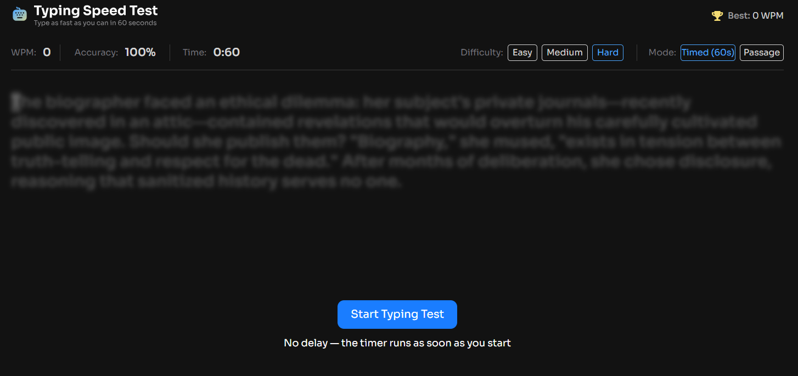
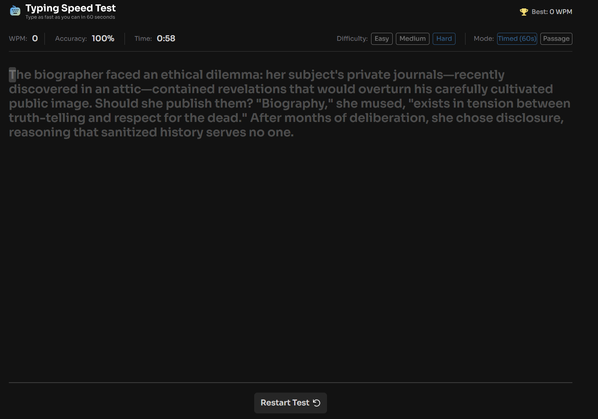
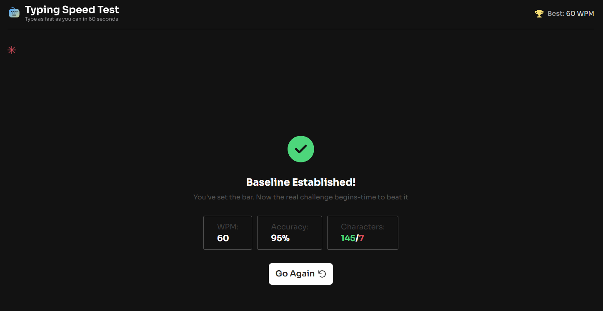

# ⌨️ Typing Speed Test

A fast, minimal typing speed test built with React, TypeScript, and Tailwind CSS. Type a passage, track your WPM and accuracy in real time, and try to beat your personal best.


[](https://rococo-tulumba-60c668.netlify.app/)

## 🔗 Live Demo

**[👉 Try it live here](https://rococo-tulumba-60c668.netlify.app/)**

Click the link above to open the app and take the test right in your browser — no install needed.

## 📸 Screenshots

| Idle / Start Screen                    | Typing In Progress                         | Results Screen                               |
| -------------------------------------- | ------------------------------------------ | -------------------------------------------- |
|  |  |  |

## ✨ Features

- **Live stats** — WPM, accuracy, and elapsed time update as you type
- **Difficulty levels** — Easy, Medium, and Hard passages of increasing length and complexity
- **Two modes** — Timed (60s) or full Passage
- **Personal best tracking** — your top WPM is saved for the session and celebrated with a "High Score Smashed!" screen
- **Responsive layout** — dedicated desktop and mobile difficulty/mode selectors

## 🛠️ Tech Stack

- [React](https://react.dev/) + [TypeScript](https://www.typescriptlang.org/)
- [Tailwind CSS v4](https://tailwindcss.com/)
- [clsx](https://github.com/lukeed/clsx) for conditional class names
- [react-icons](https://react-icons.github.io/react-icons/) for UI icons
- Deployed on [Netlify](https://www.netlify.com/)

## 🚀 Getting Started

### Prerequisites

- Node.js 18+
- npm (or yarn/pnpm)

### Installation

```bash
git clone https://github.com/TornikeTt/Typing-speed-test.git
cd Typing-speed-test
npm install
```

### Run the dev server

```bash
npm run dev
```

Then open [http://localhost:5173](http://localhost:5173) in your browser.

### Build for production

```bash
npm run build
```

## 📁 Project Structure

```
src/
├── Components/
│   ├── Header/
│   │   ├── Header.tsx
│   │   ├── DesktopDifficultySelector.tsx
│   │   └── MobileDifficultySelector.tsx
│   ├── Main.tsx        # Typing area and input handling
│   ├── Footer.tsx       # Restart control
│   └── Results.tsx      # Post-test results screen
├── hooks/
│   └── useTestStats.ts  # WPM / accuracy / timer logic
├── assets/
│   └── images/
├── App.tsx
├── App.css
├── data.json             # Passage bank (easy / medium / hard)
├── types.ts               # Shared TypeScript types
└── main.tsx
```

## ⌨️ How It Works

1. Pick a **difficulty** (Easy, Medium, Hard) and a **mode** (Timed or Passage).
2. Click **Start Typing Test** and begin typing — the timer starts on your first keystroke.
3. Correct characters turn green; mistakes turn red and underlined. Use Backspace to correct yourself.
4. The test ends when you finish the passage (or time runs out in Timed mode).
5. See your **WPM**, **accuracy**, and **character breakdown**, then hit **Go Again** to retry.

## 🧑‍💻 Type Safety

All shared prop and state types live in [`src/types.ts`](./src/types.ts) — components import from there rather than declaring their own inline types, keeping the type surface consistent across the app.
